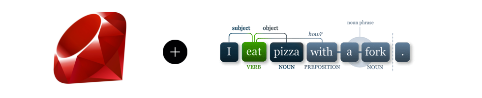

# Awesome Natural Language Processing with Ruby

This curated list comprizes _awesome_ resources, libraries, information sources about Processing of Human Languages with Ruby.
We plan to provide not only links but also a short _tutorial_ for every included tool.
Any help, suggestions and contributions are welcome. Please read the [contributors guide](CONTRIBUTING.md).

### Todo List
* [ ] Create the directory structure for turorials with named tools.
* [ ] Find an appropriate main entry structure with a license badge.
* [ ] Create a tag system for non hierarchical entry classification, use colored badges.

### Table on Contents

* [NLP Pipeline Subtasks](#nlp-pipeline-subtasks)
  * [Segmentation](#segmentation)
  * [Lexical Processing](#lexical-processing)
  * [Phrasal Level Processing](#phrasal-level-processing)
  * [Syntactic Processing](#syntactic-processing)
    * [Dependency Parsing](#dependency-parsing)
    * [Constituency Parsing](#constituency-parsing)

  * [Semantic Analysis](#semantic-analysis)
  * [Pragmatical Analysis](#pragmatic-analysis)

* [High Level Tasks](#high-level-tasks)
  * [Word Sense Disambiguation](#word-sense-disambiguation)
  * [Machine Translation](#machine-translation)
  * [Question Answering](#question-answering)
  * [Sentiment Analysis](#sentiment-analysis)

* [Machine Learning Libraries](#machine-learning-libraries)

* [Other resources](#other-resources)

## NLP Pipeline Subtasks

### Segmentation

Tokenization, Word and Sentence Boundary Detection and Disambiguation

* [tokenizer](https://github.com/arbox/tokenizer) - a simple multilingual tokenizer.
* [Pragmatic Tokenizer](https://github.com/diasks2/pragmatic_tokenizer) - a multilingual tokenizer to split a string into tokens
* [NLP Pure](https://github.com/parhamr/nlp-pure) - natural language processing algorithms implemented in pure Ruby with minimal dependencies
* [Textoken](https://github.com/manorie/textoken) - simple and customizable text tokenization library.
* [Pragmatic Segmenter](https://github.com/diasks2/pragmatic_segmenter) - WBD tool with many cookies.
* [Punkt Segmenter](https://github.com/lfcipriani/punkt-segmenter) - Ruby implementation of the Punkt Segmenter.
* [TactfulTokenizer](https://github.com/zencephalon/Tactful_Tokenizer) - RegExp based tokenizer for different languages.
* [Scapel](https://github.com/louismullie/scalpel) - SBD tool.

### Lexical Processing

#### Stemming

Stemming is the term used in linguistic morphology and information retrieval to describe the process for reducing inflected (or sometimes derived) words to their word stem, base or root form.

* [Ruby-Stemmer](https://github.com/aurelian/ruby-stemmer) - Ruby-Stemmer exposes the SnowBall API to Ruby
* [uea-stemmer](https://github.com/ealdent/uea-stemmer) - a conservative stemmer for search and indexing

#### Lemmatization
- [ ] Add some resources

### Phrasal Level Processing
- [ ] Add some resources

### Syntactic Processing
- [ ] Add some resources

#### Dependency Parsing
- [ ] Add some resources

#### Constituency Parsing
- [ ] Add some resources

### Semantic Analysis
- [ ] Add some resources

### Pragmatical Analysis
- [ ] Add some resources

## High Level Tasks

### Word Sense Disambiguation
- [ ] Add some resources

### Machine Translation
- [ ] Add some resources

### Question Answering
- [ ] Add some resources

### Sentiment Analysis
- [ ] Add some resources

## Machine Learning Libraries

Libraries in pure Ruby or written in other programming languages with appropriate bindings for Ruby.

* [Ruby Bindings to LibSVM](https://github.com/febeling/rb-libsvm) - Support Vector Machines with Ruby.
* [JRuby Bindings to Weka](https://github.com/paulgoetze/weka-jruby) - Different ML algorithms implemented through Weka.
* [Decision Trees](https://github.com/igrigorik/decisiontree) - Decision Tree ID3 Algorithm in pure Ruby.

## Other Resources
* [Awesome Ruby](https://github.com/sdogruyol/awesome-ruby)
* [Ruby NLP](https://github.com/diasks2/ruby-nlp)
* [Speech and Natural Language Processing](https://github.com/edobashira/speech-language-processing)
